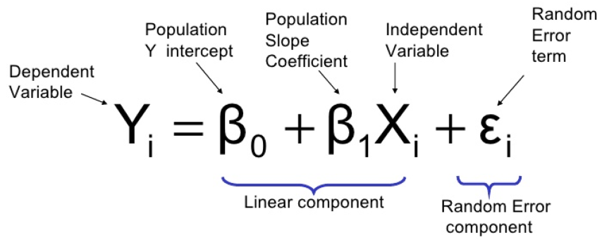

# Regression

### Process
1. Pick & Run the Regression Method that best suits the Problem _[OLS | Weighted | Total | Non-Linear | Robust | GLM]_
2. Plot & Study Residuals
    + Outliers & Influential Points
    + Normality & Homoscedasicity
    + Model Error
    + Residual Independence

## Ordinary Least Squares
"Provides the **B**est **L**inear **U**nbiased **E**stimate of the parameters if the _ASSUMPTIONS_ of OLS are True"

### Assumptions
1. E is a Random Variable that does not depend on x
2. All Ei are Independent of each other _Independent & Identically Distributed_
3. All Ei have the same probability Density Function, thus same variance _HOMOSCEDASTIC_
4. E ~ N(): _Normally Distributed_
---
## Tests

### Normality of Residuals
> **Detections**: Histogram / QQ / Shapiro-Wilk Test

### Outliers
> **Detections**: Skewness/ Kurtosis / IQR Test / Grubbs Test \

* **Outliers**: generated by a different mechanism\
* **Spurious**: nothing to teach us about the subject matter of Interest\
* **Leverage**: Data with an extreme value of the predicted x's "Accounting for Correlation". _(Williams Graph | Hat Values)_ \
* **Influence**: Removing data point substantially changes the Regression Results. _(Cook's Distance)_

### Model Error
> **Detections**: F-Test | Residual Plot | Residual Independence | Goodness of Fit | Multi-Collinearity  

* Some of the Variance in **y** isn't properly Explained _"Underfitting/Overfitting"_

### Heteroscedasticity
> **Detections**: Residual Plot | Bartlett Test

* **Causes**: Wrong Model | Outliers | Non-Normal Errors
* **Remedies**: Transformation(Log|Sqrt|BoxCox) | Weighted Regression

---

# Simple Linear Regression

### Maximum Likelihood Estimates
* Likelihood Function: probability of getting this exact dataset given a known model
* Maximum Likelihood: what parameter values maximized the likelihood function

## Least Squares Error

Standard Error | Confidence Interval | Hypothesis Test
--- | --- | ---
 |  | 

---

# Multiple Regression
> **Marginal Effect** - "Holding all other variables constant"\
> **Simplest** - "Strive for Parsimony"\
> **Interactions** - "Influence of x on y depends on the magnitude of x"

## Multi-Collinearity "Confounding Variables"
**_CAUSES_**
* Sampling
* Population demands Correlation
* Wrong Model

**_PROBLEMS_**
* Changes Coefs
* SE(Bp) becomes Large
* Overall Model is Significant, however Individual coefs may not be
* Simpson's Paradox

**_DETECT_**
1. Correlation Matrix
2. Variance Inflation Factor
3. Eigensystem Analysis

**_ADDRESS_**
* VIF [ **> 4**-Investigate | **>10**-Remove ]
* PCA: PLS | PLR
* REGULARIZATION

## Model-Selection
**BEST SUBSET | Forward | Backward
